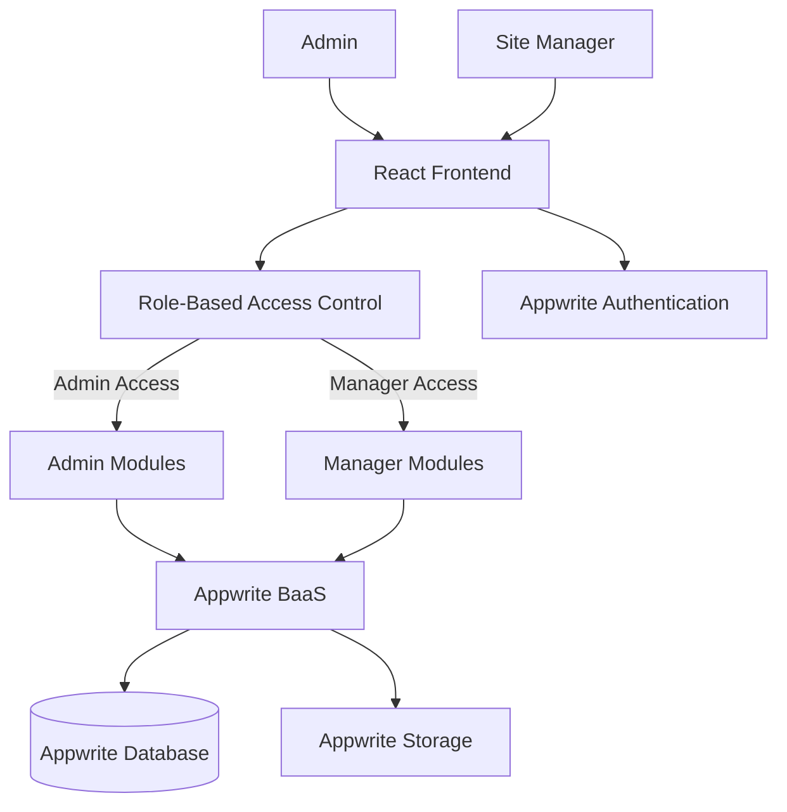
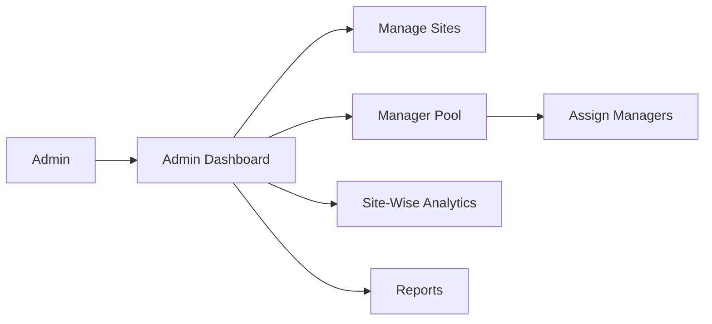
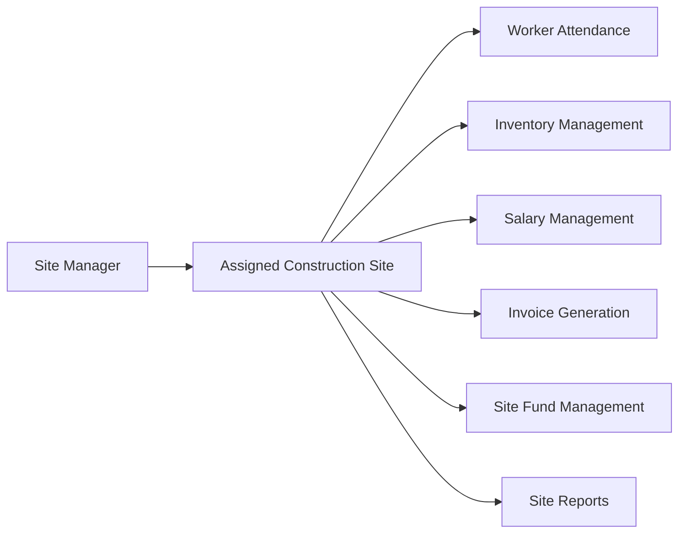

# Samarth Developers

Samarth Developers is a construction site management platform designed to digitize and simplify the management of construction projects, workers, engineers, inventory, finances, and site operations.

The platform replaces manual and fragmented processes with a centralized digital system for managing multiple construction sites.

---

## Problem Statement

Construction companies often manage their operations manually using registers, spreadsheets, and disconnected systems.

This creates challenges such as:

- Manual attendance tracking
- Difficulty managing workers and engineers
- Poor inventory visibility
- Manual invoice generation
- Complex salary calculations
- Difficult site fund management
- Lack of centralized site-wise reports
- Difficulty assigning managers to different sites

---

## Solution

Samarth Developers provides a centralized platform for managing construction operations.

The system enables administrators and managers to manage sites, workers, engineers, attendance, inventory, invoices, salaries, funds, and reports from a single platform.

---

##  Key Features

### 👨‍💼 Role-Based Access Control

The platform provides different access levels based on user roles.

#### 🛡️ Admin

- Manage and monitor all construction sites
- View site-wise performance and analysis
- Access centralized data and reports
- Manage managers and site assignments
- Monitor workers, engineers, inventory, and finances

#### 👷 Manager

- Manage assigned construction sites
- Track worker attendance
- Manage site inventory
- Manage site funds
- Generate invoices
- Manage workers and engineers
- View site-specific reports

---

### 🏗️ Site Management

- Create and manage construction sites
- Assign managers to sites
- Monitor site-wise operations
- View site-specific data and analytics

---

### 👥 Workforce Management

The platform supports management of:

- Construction workers
- Engineers
- Site managers

The system supports different salary structures:

- Weekly salary calculation for workers
- Monthly salary calculation for engineers

---

### 🕒 Digital Attendance

Replaces manual attendance registers with a digital attendance system.

Managers can:

- Record worker attendance
- Track attendance history
- Use attendance data for salary calculation

---

### 📦 Inventory Management

Managers can manage site inventory including:

- Construction materials
- Available stock
- Material usage
- Inventory records

This helps reduce manual inventory tracking and improves visibility into site resources.

---

### 🧾 Invoice Generation

The system supports digital invoice generation for construction-related operations.

This helps reduce manual paperwork and centralizes invoice records.

---

### 💰 Site Fund Management

Managers can:

- Track site funds
- Record expenses
- Monitor financial activity
- Manage site-level transactions

Administrators can view financial data across multiple sites.

---

### 📊 Reports and Analysis

The platform provides site-wise data and analysis.

Administrators can analyze:

- Site performance
- Workforce information
- Attendance data
- Inventory data
- Salary information
- Financial activity

---

### 👥 Manager Pool

The manager pool allows administrators to:

- Maintain a list of available managers
- Assign managers to construction sites
- Reassign managers when required
- Manage site responsibilities

---

# 🏗️ System Architecture

Samarth Developers follows a role-based client-server architecture using React and Appwrite BaaS.



---

# 🔄 Application Workflow

```text
User
  ↓
React Frontend
  ↓
Authentication
  ↓
Role Verification
  ↓
Admin / Manager Dashboard
  ↓
Authorized Operations
  ↓
Appwrite Database
```

---

# 👨‍💼 Admin Workflow



---

# 👷 Manager Workflow



---

# 🧰 Technology Stack

## Frontend

- React
- JavaScript
- Tailwind CSS

## Backend / BaaS

- Appwrite BaaS

## Appwrite Services

- Appwrite Authentication
- Appwrite Database
- Appwrite Storage

## Security

- Role-Based Access Control (RBAC)

## Development Tools

- Git
- GitHub
- VS Code

---

# 📂 Core Modules

```text
Samarth Developers
│
├── Authentication
│
├── Role-Based Access Control
│
├── Admin Management
│   ├── Site Management
│   ├── Manager Pool
│   ├── Manager Assignment
│   └── Site-Wise Analytics
│
├── Manager Management
│   ├── Worker Management
│   ├── Engineer Management
│   ├── Attendance
│   ├── Inventory
│   ├── Invoice Generation
│   ├── Salary Management
│   ├── Site Funds
│   └── Reports
│
└── Appwrite Services
    ├── Authentication
    ├── Database
    └── Storage
```

---

# 🎯 Impact

Samarth Developers helps construction businesses:

- Reduce manual paperwork
- Digitize attendance tracking
- Improve inventory visibility
- Simplify salary calculations
- Centralize site finances
- Improve manager-site allocation
- Provide administrators with centralized analytics
- Improve operational transparency across construction sites

---

# 🚀 Future Improvements

- Mobile application for workers and managers
- GPS-based attendance
- Automated salary generation
- Advanced financial analytics
- Inventory forecasting
- Automated notifications
- AI-based construction site analysis
